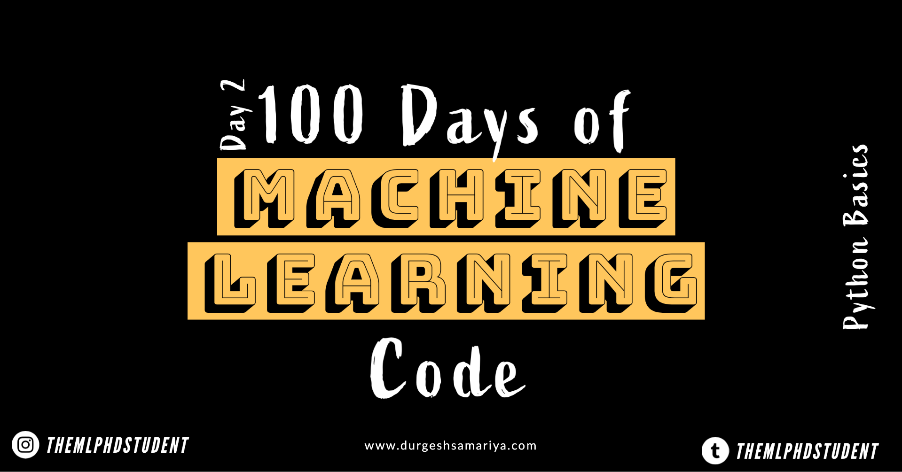

# 100 Days of Machine Learning Round 1

## Day 0 | April 11, 2020

D-Day is here and finally, I am accepting 100 days of machine learning code challenge.

On 11 Apr, 2020, I am accepting a challenge, which is “100-Days-Of-Machine-Learning-Code” and the intuition behind this to dedicate at least one hour of every day for next 100 days in studying and/or coding Machine Learning.
I will share my progress via :

GitHub: https://github.com/durgeshsamariya/100DaysofMachineLearning

Twitter : www.twitter.com/@themlphdstudent

Instagram : www.instagram.com/@themlphdstudent

My Webpage : www.durgeshsamariya.com

Medium : https://medium.com/@durgeshsamariya

You can read article [here](https://medium.com/@durgeshsamariya/100-days-of-machine-learning-code-a9074e1c42c3).

_**Make sure you subscribe and give star to repository, so you can enjoy amazing free resources.**_

## Day 1 | April 12, 2020

By starting day 1, I am taking this challenge and dedicate myself to study machine learning one hour a day till next 100 days.

I have read many self taught Machine Learning articles on web. I think first step is to pick a programming language. In my opinion, Python is the best for this. Even from my first year of PhD I am using this so I am more comfortable with Python.

But those who are new to Machine Learning, I highly recommend Python.

### Why python

- Simple and Easy
- Great community
- Great library
- Increasing popularity

Today I started reading Python Crash Course book by Eric. I read chapter 1, 2 and 3 today. You can read article [here](https://medium.com/the-innovation/python-basics-variables-data-types-and-list-59cea3dfe10f) and notebook [here](https://github.com/themlphdstudent/100DaysofMachineLearning/blob/master/round%201/Day%201%20-%20Python-basics-1.ipynb). 

## Day 2 | April 13, 2020

Today I read chapter 4 and 6 of Python Crash Course book. You can read article [here](https://towardsdatascience.com/python-basics-2-working-with-list-tuples-dictionaries-871c6c01bb51) and notebook [here](https://github.com/themlphdstudent/100DaysofMachineLearning/blob/master/round%201/Day%202%20-%20Python-basics-2.ipynb).

## Day 3 | April 14, 2020

TOday I manage to finish chapter 5 and 7 of Python Crash Course book. Tou can read article [here](https://medium.com/towards-artificial-intelligence/python-basics-3-97a8e69066e7) and notebook [here](https://github.com/themlphdstudent/100DaysofMachineLearning/blob/master/round%201/Day%203%20-%20Python-basics-3.ipynb).

## Day 4 | April 15, 2020

Today I read chapter 8 and 9 of Python Crash Course book. You can read article [here](https://medium.com/javarevisited/python-basics-4-functions-working-with-functions-classes-working-with-class-inheritance-70e0338c1b2e) and notebook [here](https://www.kaggle.com/themlphdstudent/python-basics-4).

## Day 5 | April 16, 2020

Today I read chapter 8 and 9 of Python Crash Course book. You can read article [here](https://medium.com/towards-artificial-intelligence/python-basics-5-files-and-exceptions-by-durgesh-samariya-5d892d170640) and notebook [here]().

## Day 6 | April 17, 2020

Today I learnd about OOPs concepts in Python ([here](https://github.com/durgeshsamariya/100DaysofMachineLearning/blob/master/Day%20003/OOPs%20Concepts.ipynb)).

## Day 7 | April 18, 2020

Learned more about Pandas library. Now its time to move on different topic. I will learn more on pandas (excercise) if need. You can find code [here](https://github.com/durgeshsamariya/100DaysofMachineLearning/blob/master/Day%20006/NumPy.ipynb).

Happy Weekend.

## Day 8 | April 19, 2020
Learned advanced NumPy concepts : Liner Algebra. You can find code [here](https://github.com/durgeshsamariya/100DaysofMachineLearning/blob/master/Day%20008/NumPy.ipynb).

## Day 9 | April 20, 2020
Learned about Data handling, storage and file formate using Pandas library. You can find code [here](https://github.com/durgeshsamariya/100DaysofMachineLearning/blob/master/Day%20009/Day9.ipynb).

## Day 10 to Day 12 | April 21, 2020 to April 23,2020
I did two Covid-19 visualization project. One is effect of COVID-19 on India and another one is COVID-19 on Globe.
 Learned about web scraping, data cleaning and some visualization techniques. You can find code from [COVID-19 India](https://github.com/durgeshsamariya/Covid19India) and [Covid-19](https://github.com/durgeshsamariya/COVID19).

## Day 13 | April 24, 2020

## Day 14 | April 25, 2020

## Day 15 | April 26, 2020

## Day 16 | April 27, 2020

## Day 17 | April 28, 2020

## Day 18 | April 29, 2020

## Day 19 | April 30, 2020

## Day 20 | May 1, 2020

## Day 21 | May 2, 2020

## Day 22 | May 3, 2020

## Day 23 | May 4, 2020

## Day 24 | May 5, 2020

## Day 25 | May 6, 2020

## Day 26 | May 7, 2020

## Day 27 | May 8, 2020

## Day 28 | May 9, 2020

## Day 29 | May 10, 2020

## Day 30 | May 11, 2020

## Day 31 | May 12, 2020

## Day 32 | May 13, 2020

## Day 33 | May 14, 2020

## Day 34 | May 15, 2020

## Day 35 | May 16, 2020

## Day 36 | May 17, 2020

## Day 37 | May 18, 2020

## Day 38 | May 19, 2020

## Day 39 | May 20, 2020

## Day 40 | May 21, 2020

## Day 41 | May 22, 2020

## Day 42 | May 23, 2020

## Day 43 | May 24, 2020

## Day 44 | May 25, 2020

## Day 45 | May 26, 2020

## Day 46 | May 27, 2020

## Day 47 | May 28, 2020

## Day 48 | May 29, 2020

## Day 49 | May 30, 2020

## Day 50 | May 31, 2020

## Day 51 | June 1, 2020

## Day 52 | June 2, 2020

## Day 53 | June 3, 2020

## Day 54 | June 4, 2020

## Day 55 | June 5, 2020

## Day 56 | June 6, 2020

## Day 58 | June 8, 2020

## Day 59 | June 9, 2020

## Day 60 | June 10, 2020

## Day 61 | June 11, 2020

## Day 62 | June 12, 2020

## Day 63 | June 13, 2020

## Day 64 | June 14, 2020
